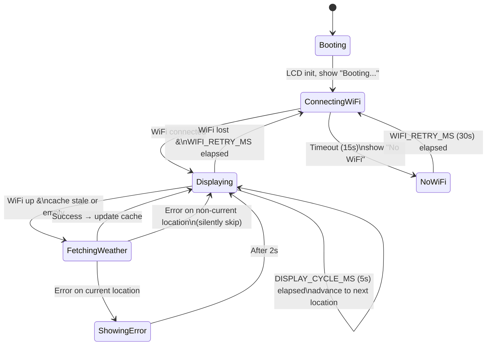

# Pico Weather Station — State Diagram

```mermaid
stateDiagram-v2
    [*] --> Booting

    Booting --> ConnectingWiFi : LCD init, show "Booting..."

    ConnectingWiFi --> Displaying : WiFi connected
    ConnectingWiFi --> NoWiFi : Timeout (15s)\nshow "No WiFi"

    NoWiFi --> ConnectingWiFi : WIFI_RETRY_MS (30s) elapsed

    Displaying --> ConnectingWiFi : WiFi lost &\nWIFI_RETRY_MS elapsed
    Displaying --> FetchingWeather : WiFi up &\ncache stale or empty
    Displaying --> Displaying : DISPLAY_CYCLE_MS (5s) elapsed\nadvance to next location

    FetchingWeather --> Displaying : Success → update cache
    FetchingWeather --> ShowingError : Error on current location
    FetchingWeather --> Displaying : Error on non-current location\n(silently skip)

    ShowingError --> Displaying : After 2s
```
